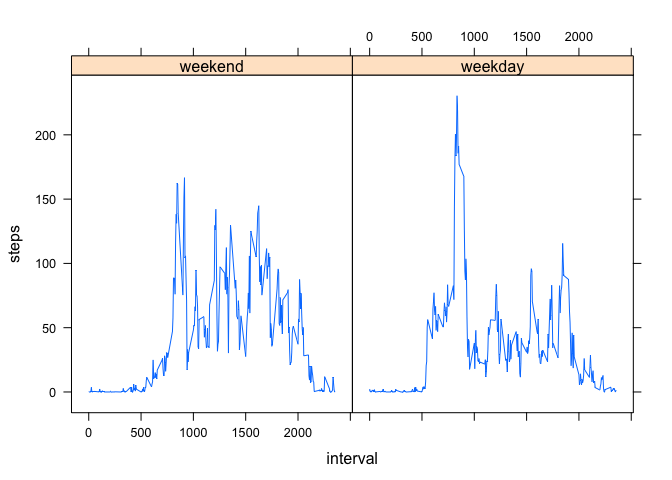

# Reproducible Research: Peer Assessment 1
Yi JIN  


## Loading and preprocessing the data

The first step is to unzip the file and obtain the file "activity.csv", then read it into R by `read.csv()`. `stringsAsFactors = FALSE` is set in order to prevent the auto conversion from date to factor. The variable "date" is then set to `as.Date`.


```r
unzip("activity.zip", overwrite = TRUE)
actiDat <- read.csv("activity.csv", stringsAsFactors = FALSE)
actiDat$date <- as.Date(actiDat$date, format = "%Y-%m-%d")
str(actiDat)
```

```
## 'data.frame':	17568 obs. of  3 variables:
##  $ steps   : int  NA NA NA NA NA NA NA NA NA NA ...
##  $ date    : Date, format: "2012-10-01" "2012-10-01" ...
##  $ interval: int  0 5 10 15 20 25 30 35 40 45 ...
```

## What is mean total number of steps taken per day?

In order to calculate the total number of the steps taken per day. We should do the `sum` over the variable "steps" by each date. (NA is removed by using `na.rm = TRUE`)


```r
res_step_per_dat <- aggregate(x = actiDat["steps"], by = actiDat["date"], FUN = "sum", na.rm = TRUE)
```

Once the result is created, we then draw the histogram:


```r
hist(res_step_per_dat$steps, breaks = 10, xlab = "Steps", main = "Histogram of Steps")
```

 

Calculating the mean and median of total number of steps taken per day:


```r
cat("The mean of total number of steps taken per day: ", mean(res_step_per_dat$steps), "steps. ")
```

```
## The mean of total number of steps taken per day:  9354.23 steps.
```

```r
cat("The median of total number of steps taken per day: ", median(res_step_per_dat$steps), "steps. ")
```

```
## The median of total number of steps taken per day:  10395 steps.
```

## What is the average daily activity pattern?

We now calculate the average steps taken per 5 minutes interval.


```r
res_avg_int <- aggregate(x = actiDat["steps"], by = actiDat["interval"], FUN = mean, na.rm = TRUE)
plot(x = res_avg_int$interval, y = res_avg_int$steps, type = "l", xlab = "Interval", ylab = "Average Steps")
```

 

We then look for the max.


```r
res_avg_int[which.max(res_avg_int$steps),]
```

```
##     interval    steps
## 104      835 206.1698
```

We can see that for the interval 835, we have the average steps 206.1698113.

## Imputing missing values

The missing valuses in the dataset can be detected by using `is.na`.


```r
cat("The total count of missing value is:", sum(is.na(actiDat$steps)))
```

```
## The total count of missing value is: 2304
```

In order to impute the missing value, we have taken the strategy that implementing the mean value for the 5 minutes interval.


```r
NA_avg_int <- aggregate(x = actiDat["steps"], by = actiDat["interval"], FUN = mean, na.rm = TRUE)
```

We will create a new dataset with imputed value:


```r
new_actiDat <- merge(actiDat, NA_avg_int, by = "interval", all.x = TRUE)
new_actiDat$steps.x[is.na(new_actiDat$steps.x)] <- new_actiDat$steps.y[is.na(new_actiDat$steps.x)]
## remove steps.y and rename steps.x
new_actiDat <- new_actiDat[c("steps.x", "date", "interval")]
colnames(new_actiDat)[1] <- "steps"
## reorder
new_actiDat <- new_actiDat[order(new_actiDat$date, new_actiDat$interval), ]
```

Then we recalculate a histogram of the total number of steps taken each day and Calculate and report the mean and median total number of steps taken per day. 


```r
res_step_per_dat_new <- aggregate(x = new_actiDat["steps"], by = new_actiDat["date"], FUN = "sum")
hist(res_step_per_dat_new$steps, breaks = 10, xlab = "Steps", main = "Histogram of Steps")
```

 

Calculating the mean and median of total number of steps taken per day:


```r
cat("The mean of total number of steps taken per day: ", mean(res_step_per_dat_new$steps), "steps. ")
```

```
## The mean of total number of steps taken per day:  10766.19 steps.
```

```r
cat("The median of total number of steps taken per day: ", median(res_step_per_dat_new$steps), "steps. ")
```

```
## The median of total number of steps taken per day:  10766.19 steps.
```

With the imputed NA, the mean and the median values have increased. And the histogram become more centralized and bell-shaped like. 

## Are there differences in activity patterns between weekdays and weekends?

Then we will use the filled-in missing value for analyzing the activity patterns between weekdays and weekends. We will create a variable which indicates weekdays or weekends.


```r
new_actiDat$weekdays <- factor(weekdays(new_actiDat$date) %in% c("Monday", "Tuesday", "Wednesday", "Thursday", "Friday"))
levels(new_actiDat$weekdays) <- c("weekend", "weekday")
```

Then prepare the aggregated data for the plot:


```r
plotDat <- aggregate(new_actiDat["steps"], by = new_actiDat[c("weekdays", "interval")], FUN = "mean")
library(lattice)
xyplot(steps ~ interval | weekdays, data = plotDat, type = "l")
```

 


